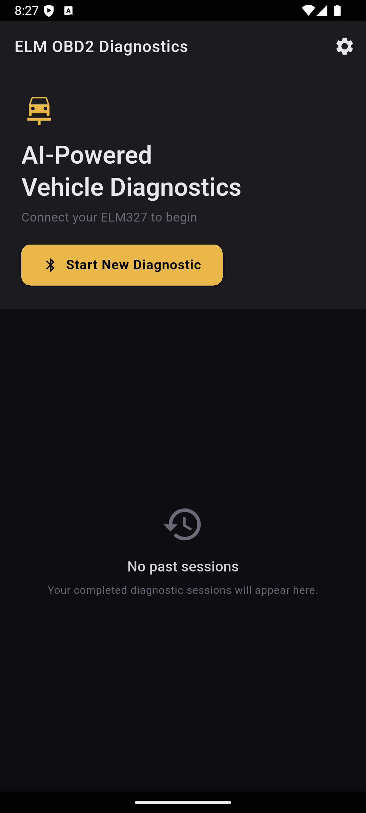
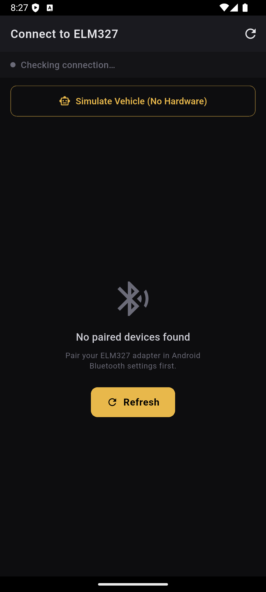
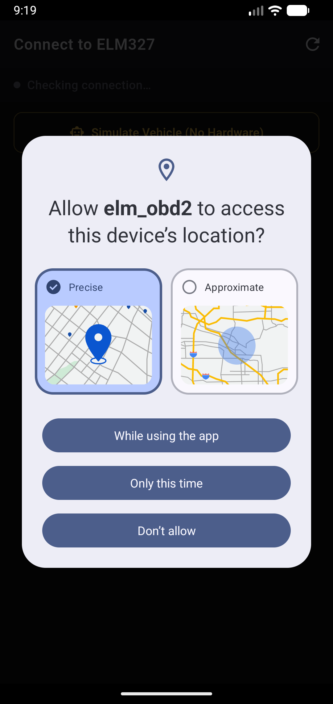
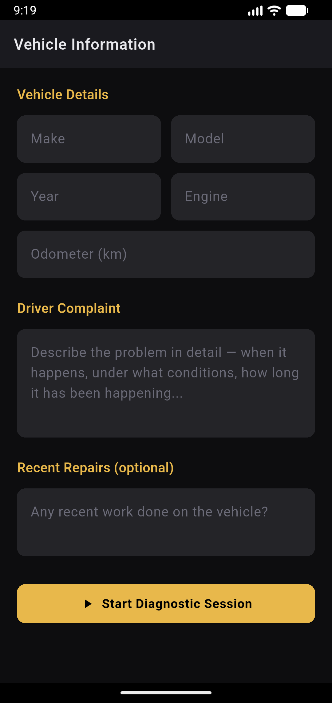
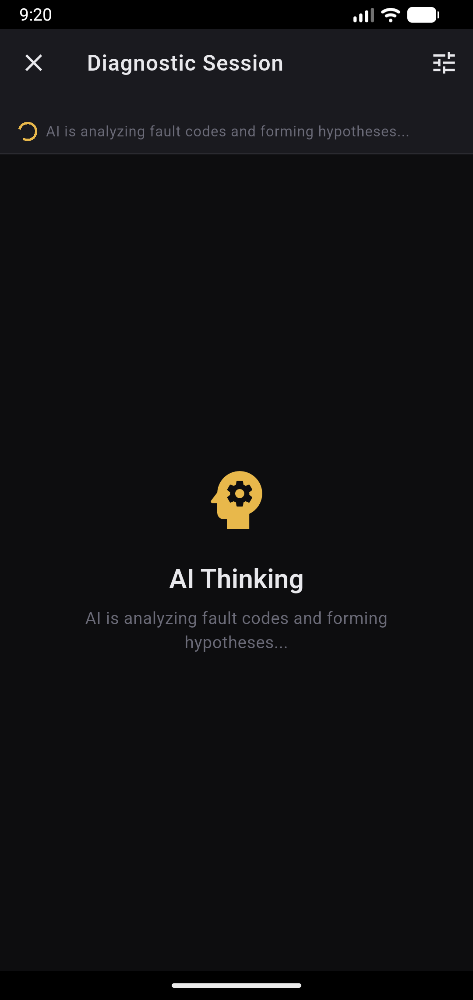
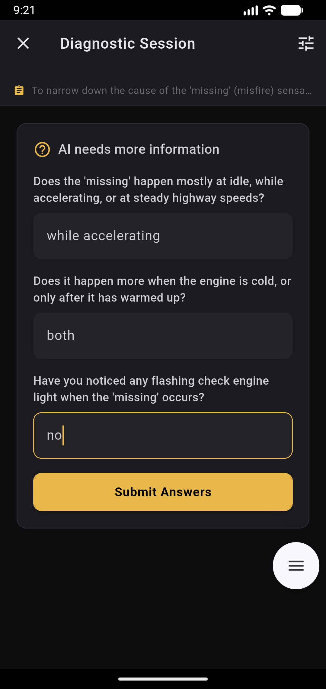
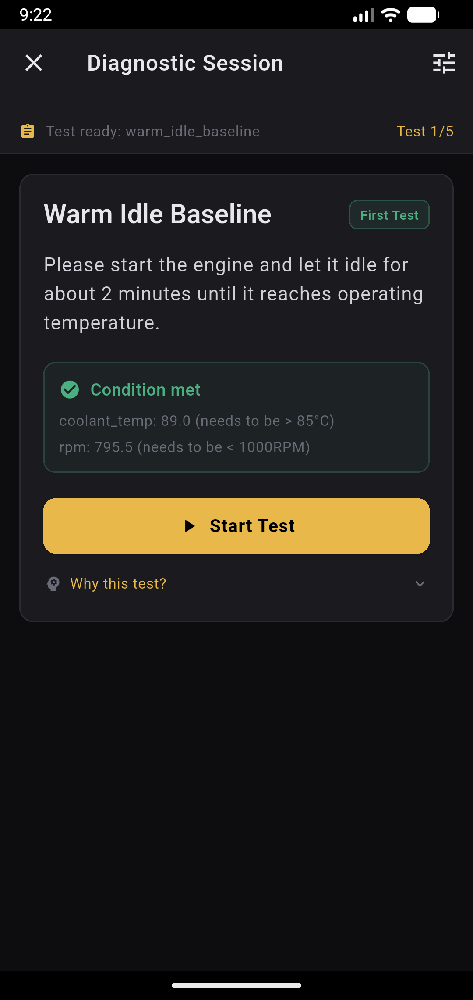
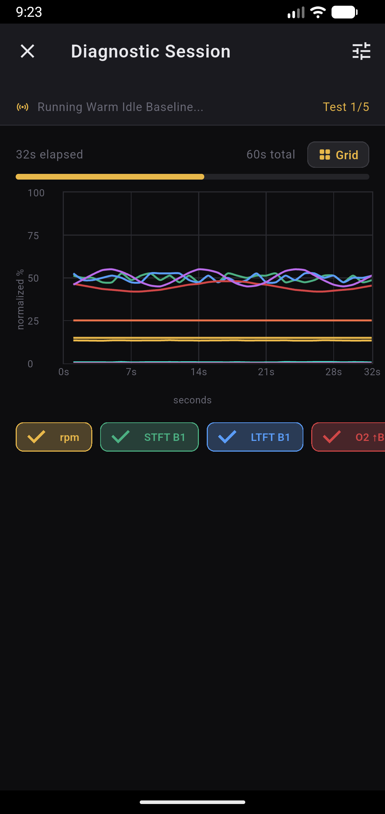

# ELM OBD2 AI Diagnostics

An Android app that connects to an ELM327 Bluetooth OBD2 adapter and runs AI-driven diagnostic sessions using **Gemini 2.0 Flash**. The app behaves like an expert mechanic — it reads fault codes, forms competing hypotheses, prescribes specific sensor tests, collects real data from the vehicle, and produces an evidence-based diagnosis with recommended actions.

[Screenshots](#screenshots) · [Download APK](https://github.com/msamoeed/elm-obd2/releases)

---

## How it works

```
Connect ELM327 (or simulate)  →  Fill intake form  →  AI reads DTCs + forms hypotheses
       ↓
AI prescribes a test  →  User meets condition (e.g. engine warm, idle)
       ↓
App polls OBD2 sensors for test duration  →  Summarises data
       ↓
AI analyses summary  →  [repeat up to 5 tests]
       ↓
AI concludes diagnosis with confidence, evidence, severity, and next steps
```

The AI never diagnoses from fault codes alone. Every conclusion is backed by live sensor evidence collected during structured tests.

---

## Features

- **Bluetooth Classic (SPP)** connection to ELM327 adapters
- **Simulated vehicle mode** — full diagnostic flow without hardware, with configurable fault profiles
- **Live monitor** — standalone real-time PID dashboard with sparkline charts
- **18 diagnostic tests** covering fuel delivery, air metering, O2 sensors, catalyst efficiency, EGR, misfires, cold-start behaviour, and more
- **Gemini 2.0 Flash function calling** — AI only responds via structured function calls (`prescribe_test`, `request_vehicle_info`, `conclude_diagnosis`, `request_live_narration`)
- **Automatic PID support detection** — skips unsupported sensors gracefully, tells the AI which sensors were unavailable
- **Session checkpointing** — if the app is killed mid-session, an interrupted session is detected on next launch and can be resumed (Gemini context is reconstructed from saved test summaries)
- **Gemini Live voice narration** during active test collection
- **PDF report export** with full evidence summary
- **Dark automotive UI** with live sensor dashboards and real-time charts

---

## Requirements

- Android phone with Bluetooth Classic support (Android 5.0+, minSdk 21)
- ELM327 Bluetooth Classic (SPP) OBD2 adapter — paired in Android Bluetooth settings before use (or use simulated mode)
- A Google AI Studio API key with Gemini access — see [Getting a Gemini API key](#getting-a-gemini-api-key) below
- Flutter SDK 3.7+

> **Note:** Bluetooth LE / BLE adapters are **not** supported. The app uses the RFCOMM Serial Port Profile (SPP).

---

## Setup

### 1. Clone and install dependencies

```bash
git clone https://github.com/msamoeed/elm-obd2.git
cd elm-obd2
flutter pub get
```

Before your first diagnostic session, add a Gemini API key in the app — see [Getting a Gemini API key](#getting-a-gemini-api-key).

### 2. Run on a physical Android device

```bash
flutter run
```

> The app requires a real device for Bluetooth. Use **Simulate Vehicle** on the connect screen to test without an ELM327 adapter.

### 3. Build a release APK (optional)

```bash
flutter build apk --release
```

The APK is written to `build/app/outputs/apk/release/app-release.apk`.

---

## Getting a Gemini API key

The app uses Google's Gemini API for diagnostic reasoning and optional live voice narration during tests. You need your own API key — it is **not** included in the app.

### Step 1 — Create a key in Google AI Studio

1. Open [Google AI Studio](https://aistudio.google.com) in a browser and sign in with a Google account.
2. Click **Get API key** in the left sidebar (or go directly to [aistudio.google.com/apikey](https://aistudio.google.com/apikey)).
3. Click **Create API key**.
4. Choose **Create API key in new project** (or select an existing Google Cloud project if you already use one).
5. Copy the key when it appears. It starts with `AIza` and looks like `AIzaSy...`.

> **Tip:** Keep this key private. Anyone with your key can make API calls billed to your Google account.

Google AI Studio offers a free tier with usage limits. If you exceed the free quota, you may need to enable billing on the linked Google Cloud project. See [Google AI pricing](https://ai.google.dev/pricing) for current limits and rates.

### Step 2 — Add the key in the app

1. Install and open **ELM OBD2 Diagnostics** on your Android phone.
2. On the home screen, tap the **gear icon** (top right) to open **Settings**.
3. Under **Gemini API Key**, paste your key into the text field.
   - Tap the eye icon to show or hide the key while typing.
   - Keys typically start with `AIza...`.
4. Tap **Save**. A green **Saved** confirmation appears when the key is stored.
5. Go back and start a diagnostic session as usual — the app reads the key automatically.

The key is saved **only on your device** (local Hive storage). It is never bundled into the APK and is not sent anywhere except to Google's Gemini API when you run a session.

### Step 3 — Verify it works

1. Connect to an ELM327 adapter (or tap **Simulate Vehicle** on the connect screen).
2. Fill in the vehicle intake form and tap **Start Diagnostic Session**.
3. If the key is missing, the session stops with: *"No Gemini API key set. Add one in Settings before starting a session."*
4. If the key is valid, you should see the **AI Thinking** screen while Gemini analyzes fault codes.

### Updating or removing your key

- **Change key:** Open **Settings**, replace the value in the field, and tap **Save**.
- **Remove key:** Open **Settings**, tap **Clear**, then confirm. Diagnostic sessions will not run until a new key is saved.

### Troubleshooting

| Problem | What to try |
|---|---|
| "No Gemini API key set" | Open **Settings**, paste your key, and tap **Save** before starting a session. |
| Session fails immediately after saving | Check for extra spaces when pasting. Re-copy the key from AI Studio and save again. |
| API errors / rate limits | Confirm the key is active at [aistudio.google.com/apikey](https://aistudio.google.com/apikey). You may have hit the free-tier limit — wait and retry, or enable billing on the project. |
| Live narration silent | Live narration also uses your Gemini API key. Ensure the key is saved and that the app has **microphone** permission if prompted. |

---

## Project structure

```
lib/
├── main.dart
├── app.dart                        # GoRouter + ProviderScope
│
├── core/
│   ├── obd/
│   │   ├── elm327_connector.dart   # BT SPP connection, serial command queue
│   │   ├── obd_service.dart        # PID polling, DTC reading, supported PID cache
│   │   ├── obd_transport.dart      # Shared transport interface (real + simulated)
│   │   ├── pid_decoder.dart        # SAE J1979 hex → engineering value formulas
│   │   ├── dtc_decoder.dart        # DTC hex → P0xxx string
│   │   ├── pid_constants.dart      # All supported PID codes and names
│   │   └── simulated/              # Virtual ECU + simulated ELM327 connector
│   │
│   ├── diagnosis/
│   │   ├── gemini_agent.dart       # ChatSession wrapper, function call router
│   │   ├── gemini_live_service.dart# Gemini Live WebSocket for voice narration
│   │   ├── test_executor.dart      # Runs a test, produces SensorSummary
│   │   ├── test_library.dart       # All 18 named test definitions
│   │   ├── function_tools.dart     # Gemini tool declarations
│   │   ├── system_prompt.dart      # Expert mechanic persona + diagnostic rules
│   │   └── models/
│   │
│   └── storage/
│       ├── session_repository.dart # Hive persistence (sessions + checkpoints)
│       └── settings_repository.dart# API key and app settings
│
└── features/
    ├── home/         # Past sessions + resume interrupted session
    ├── connect/      # Bluetooth device list, simulation mode
    ├── intake/       # Vehicle info + driver complaint form
    ├── session/      # Main diagnostic loop UI + state machine
    ├── monitor/      # Standalone live PID monitor
    ├── settings/     # Gemini API key entry
    ├── diagnosis/    # Final diagnosis report screen
    └── report/       # PDF export
```

---

## Diagnostic test library

18 tests covering the most common engine and emissions fault patterns:

| Test | Condition | What it diagnoses |
|---|---|---|
| `warm_idle_baseline` | Warm engine, idle | Fuel trims, vacuum leaks, O2 switching |
| `fuel_trim_2000rpm` | Warm, 1800–2200 RPM | Vacuum leak vs MAF/fuel pressure |
| `fuel_trim_rpm_sweep` | Warm, stationary, neutral | Full trim picture across RPM range |
| `o2_switching_analysis` | Warm, idle (5 Hz) | O2 sensor response rate |
| `cat_efficiency_test` | Warm, 2300–2700 RPM | Upstream vs downstream O2 comparison |
| `egr_response_test` | Warm, 1800–2200 RPM | EGR behavior and MAP response |
| `misfire_idle_monitor` | Warm, idle | RPM instability, near-stall events |
| `cold_start_monitor` | Coolant < 35°C | Warm-up enrichment, thermostat |
| `cold_start_temp_curve` | Coolant < 30°C | Coolant rise curve, thermostat fault |
| `fuel_pressure_idle` | Warm, idle | Fuel pump, regulator, filter |
| `maf_map_correlation` | Warm, RPM sweep | MAF accuracy vs MAP |
| `throttle_snap_test` | Warm, idle (5 Hz) | Transient enrichment, MAF peak |
| `cruise_load_fuel_trim` | Warm, 60–80 km/h | Load-dependent trim issues |
| `decel_fuel_cutoff` | Warm, coasting >50 km/h | DFCO, injector leak-down |
| `bank_fuel_trim_comparison` | Warm, idle | Bank 1 vs Bank 2 divergence (V6/V8) |
| `map_baro_sanity` | Warm, idle | MAP sensor accuracy, intake vacuum |
| `oil_temp_warmup_correlation` | Coolant > 60°C | Oil thermostat, oil cooler |
| `extended_idle_stability` | Warm, idle (5 min) | Intermittent idle faults |

---

## Key design decisions

**Serial command queue** — The ELM327 is strictly single-command: a new command is only sent after receiving `>` from the previous one. All commands go through a `Queue` with a mutex pattern.

**No raw data to Gemini** — After each test, raw readings are summarised (avg/min/max/stdDev/stability + notable events). A 60s test at 2 Hz produces 120 readings; only the statistics are sent.

**Unsupported PIDs** — Before a test starts, each required PID is checked against the supported-PID bitmask read from the ECU. Unsupported PIDs are skipped (no timeout wait) and explicitly reported to Gemini as "not available on this vehicle."

**Reconnection resilience** — On connect, any stale RFCOMM socket is torn down before opening a new one, and the connection is retried once with a 1.5 s delay to handle the Android BT stack releasing orphaned sockets from a previous app session.

**Session recovery** — A checkpoint is saved to Hive as soon as the intake scan completes, updated after each test, and finalised on diagnosis. If the app is killed mid-session, the next launch detects the interrupted session and reconstructs the full Gemini context from the saved intake prompt and test summaries.

**Simulated vehicle** — A virtual ECU implements the same OBD transport interface as the real ELM327 connector, so the diagnostic agent, test executor, and UI work identically with or without hardware.

---

## Android permissions

The following permissions are declared in `AndroidManifest.xml`:

```
BLUETOOTH, BLUETOOTH_ADMIN, BLUETOOTH_CONNECT, BLUETOOTH_SCAN
ACCESS_FINE_LOCATION, ACCESS_COARSE_LOCATION
INTERNET
RECORD_AUDIO  (Gemini Live voice narration)
```

---

## Dependencies

| Package | Purpose |
|---|---|
| `google_generative_ai` | Gemini 2.0 Flash function calling + Live API |
| `flutter_bluetooth_serial` | Bluetooth Classic SPP connection |
| `flutter_riverpod` | State management |
| `go_router` | Navigation |
| `hive_flutter` | Local session persistence + settings |
| `pdf` + `printing` | PDF report generation |
| `web_socket_channel` | Gemini Live WebSocket |
| `permission_handler` | Runtime Bluetooth + location permissions |
| `fl_chart` | Real-time sensor charts during tests and live monitor |

---

## Screenshots

<details>
<summary><strong>Show app screenshots</strong></summary>

<br>

<table>
  <tr>
    <td align="center" width="25%">
      
      <br><sub><b>Home</b></sub>
    </td>
    <td align="center" width="25%">
      
      <br><sub><b>Connect</b></sub>
    </td>
    <td align="center" width="25%">
      
      <br><sub><b>Permissions</b></sub>
    </td>
    <td align="center" width="25%">
      
      <br><sub><b>Intake</b></sub>
    </td>
  </tr>
  <tr>
    <td align="center">
      
      <br><sub><b>AI hypothesis</b></sub>
    </td>
    <td align="center">
      
      <br><sub><b>Follow-up questions</b></sub>
    </td>
    <td align="center">
      
      <br><sub><b>Test prescribed</b></sub>
    </td>
    <td align="center">
      
      <br><sub><b>Live collection</b></sub>
    </td>
  </tr>
</table>

</details>
